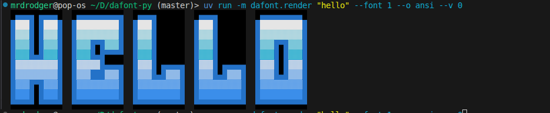

# TDFont Renderer in Python (Remake)
[Original repository by Antoine Santo (NoNameNo)](https://github.com/N0NameN0/CODEF_Ansi_Logo_Maker)

## CLI Usage: 
```
usage: dafont.render [-h] [--font INDEX] [--spacing N] [--space-size N] [--variant INDEX] [--list-fonts] text

positional arguments:
  text                  Text to render as ANSI/HTML art

options:
  -h, --help            show this help message and exit
  --font,    -f INDEX   Index of the .TDF font file to use from FONTS/ (default: 0)
  --spacing, -s N       Columns of space between each character (default: 2)
  --space-size, -ss N   Width in columns of a space character ' ' (default: 5)
  --variant, -v INDEX   Font variant index within the .TDF file (default: 0)
  --list-fonts, -l      List all available fonts and exit
  --output, -o          set output type (html, ansi)
```

## Library Usage
```python
from tdf_renderer import TDFRender

r = TDFRender()

# List available font names
print(r.list_fonts())
# ['ANSISYS', 'BROADWAY', 'ROMAN', ...]

# Render text as ANSI escape codes (print to terminal)
print(r.render("Hello", font_index=0))

# Render as HTML string
html = r.render("Hello", font_index=0, output_mode="html")
with open("output.html", "w") as f:
    f.write(html)

# Use a specific font variant (some .TDF files contain multiple)
print(r.render("World", font_index=2, variant=1))
```

## Example
